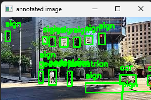

# 🚦 RoadVision Annotator

A lightweight tool for manually annotating traffic scene images and visualizing bounding boxes using OpenCV. Built to simulate real-world dataset preparation for computer vision tasks.

---

## 📁 Project Structure

- `images/` — Raw traffic images
- `annotations/` — XML annotation files from LabelImg (Pascal VOC)
- `visualize.py` — Visualizes annotations with OpenCV
- `screenshots/` — Sample output
- `README.md` — Project info

---

## 🔧 Tech Stack

- Python 3
- OpenCV
- LabelImg

---

## 🚀 How to Use

1. Annotate images using LabelImg (labels: `car`, `pedestrian`, `sign`)
2. Save XMLs to `annotations/`
3. Run:

```bash
python visualize.py

Images display until you click the arrow keys to move to next image — press q to quit early.

---

## SAMPLE

